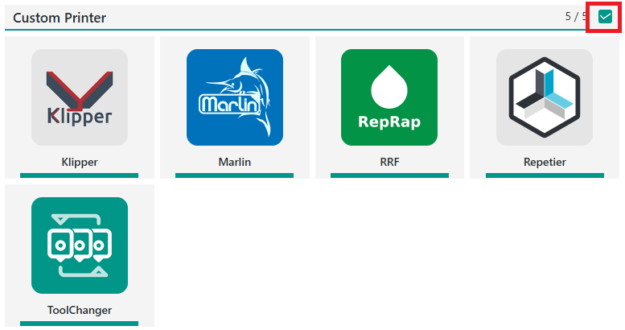
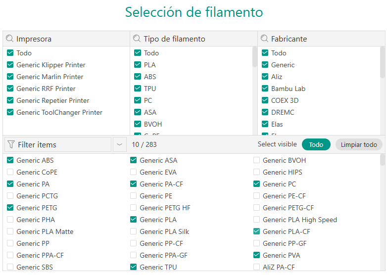
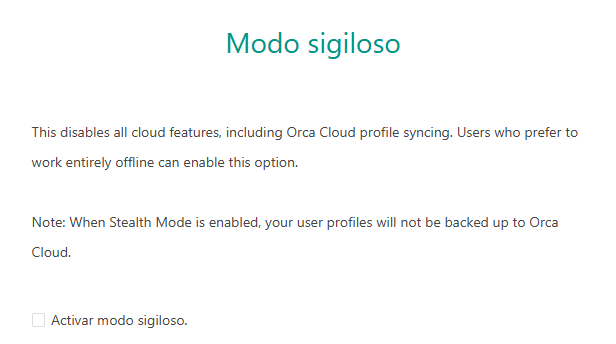
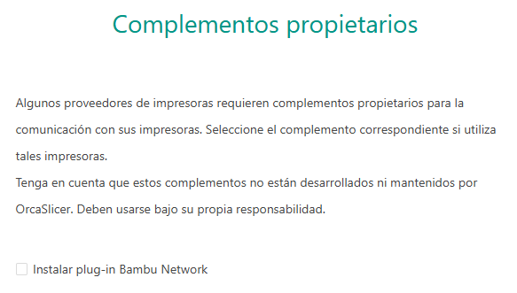
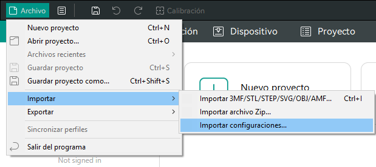
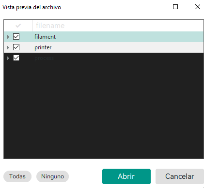
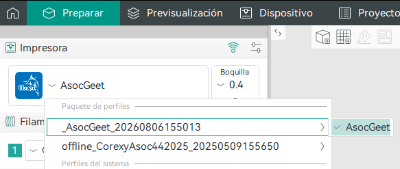
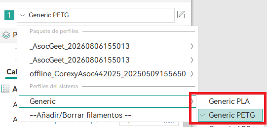

# Instalación de OrcaSlicer

* Descargar e instalar [OrcaSlicer](https://www.orcaslicer.com/download/).
* Descargar el perfil de OrcaSlicer del [drive de la asociación](https://drive.google.com/file/d/1NH_cZ7zzjfaCNTqcHYwyXUklLV9fPJUW/view?usp=drive_link). El paquete trae la configuración de la impresora, filamentos y proceso. Sirve sobre todo para cargar la configuración de la impresora. Al descargarlo, quitar la extensión ".zip".
* Con las configuraciones por defecto de los filamento alcanza. Como solo se imprime en PLA y PETG, los perfiles Generic PLA y Generic PETG son suficientes.
* Los parámetros del filamento y del proceso se pueden dejar por defecto o ajustar si hace falta. El archivo del drive se usa principalmente para la parte de la impresora.

## Instalación y carga de perfiles

1. Abrir OrcaSlicer y elegir custom printer.

2. Dejar todo como está

3. Dejar como está

4. Dejar como está

5. Cargar los archivos de configuración de la impresora que descargamos del drive

6. Seleccionar todo

7. En la sección "Preparar" se configura todo

8. Elegir la impresora del perfil cargado

9. Elegir el perfil de acuerdo al material de impresión sea PLA o PETG

10. Cambiar a la pestaña Preparar y cargar el modelo 3D que se quiere imprimir.

## Fuentes de referencia

Esto no es un tutorial detallado de impresión ni de ajuste fino del slicer. Si hace falta profundizar en parámetros de impresión o en configuración avanzada de OrcaSlicer, usar estas fuentes:

* [OrcaSlicer - documentación principal](https://www.orcaslicer.com/wiki)
* [OrcaSlicer - guía de calibración](https://www.orcaslicer.com/wiki/calibration_guide)