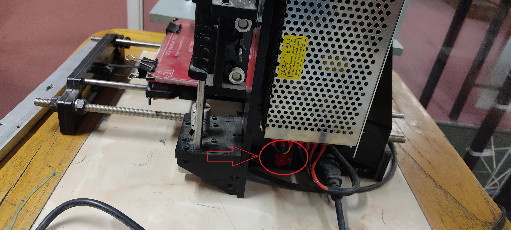
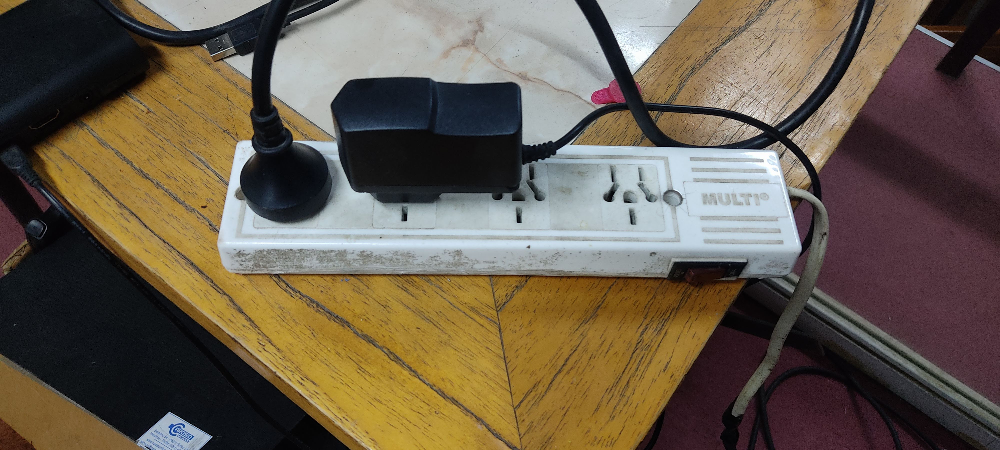
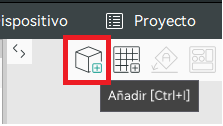
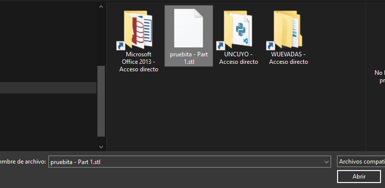
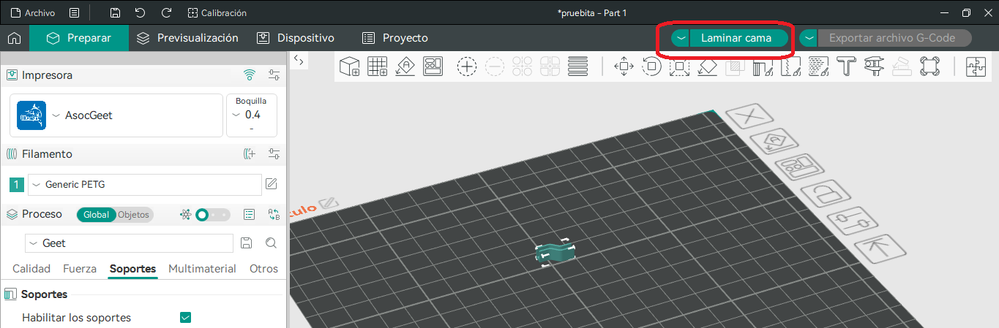
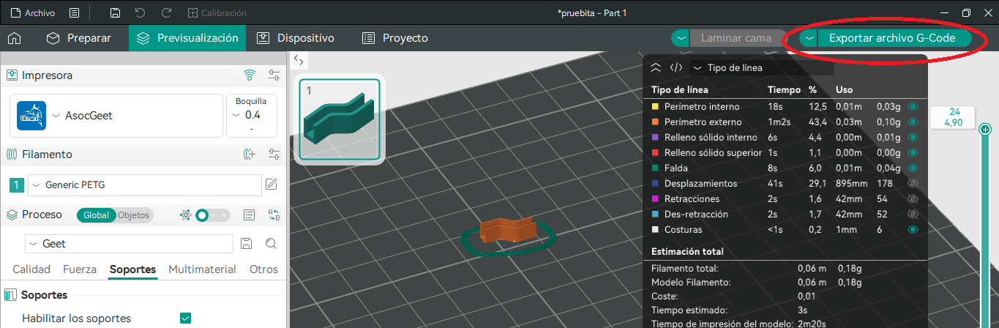

0. Prender la impresora.
    * En la zapatilla está conectada, por un lado, la impresora y, por otro lado, una Raspberry Pi, que es la que corre el servidor de [Octoprint](https://octoprint.org) para poder imprimir desde la computadora. (Fijarse que la zapatilla esté conectada y prendida).
    > No hace falta descargar nada.
    
    
1. Limpiar la cama.
2. [Nivelar la cama](./nivelación.md).
3. Descargar el archivo STL de la pieza a imprimir.
4. Luego de haber instalado y configurado el slicer de acuerdo con el documento de [instalación](./apps-y-archivos-requeridos.md), seguir los siguientes pasos en la pestaña "Preparar":
    * Agregar el objeto (STL de la/s pieza/s).
    
    
    * Realizar el laminado (Slicear).
    
    * Generar el código G (Gcode).
    
> Nota: Los pasos siguientes también se pueden hacer de [forma manual](./control-con-lcd.md) sin utilizar la computadora, a través de los comandos de la pantalla LED de la propia impresora.
5. Entrar a [Octoprint en esta URL](https://mecabot.ingenieria) usando las credenciales.
6. 
