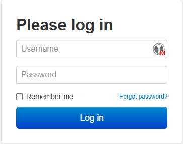

# Procedimiento
0. Prender la impresora.
    * En la zapatilla está conectada, por un lado, la impresora y, por otro lado, una Raspberry Pi, que es la que corre el servidor de [Octoprint](https://octoprint.org) para poder imprimir desde la computadora (Fijarse que la zapatilla esté conectada y prendida).
    > No hace falta descargar nada para usar Octoprint.

    
    
1. Limpiar la cama.
2. [Nivelar la cama](./nivelación.md).
3. Descargar el archivo STL de la pieza a imprimir.
4. Luego de haber instalado y configurado el slicer de acuerdo con el documento de [instalación](./apps-y-archivos-requeridos.md), seguir los siguientes pasos en la pestaña "Preparar":
    * Agregar el objeto (STL de la/s pieza/s).

    
    
    * Realizar el laminado (Slicear).
    
    * Generar el código G (Gcode).
    
> Nota: Los pasos siguientes también se pueden hacer de [forma manual](./control-con-lcd.md) sin utilizar la computadora, a través de los comandos de la pantalla LED de la propia impresora.
5. Entrar a [Octoprint en esta URL](https://mecabot.ingenieria) e ingresar utilizando las credenciales.

  

> Lo anterior es para cuando se está conectado a la red de MECACUEVA o a cualquiera de las redes del DETI I. Para poder controlar la impresora desde otra red usamos [Tailscale](https://tailscale.com/), para eso seguir los pasos indicados [mas abajo](#obtener-url-para-tailscale)

6. Verificar que la impresora esté conectada a la RASPBERRY a través del cable USB para poder controlarla.

## Obtener URL para Tailscale
* Instalar [Tailscale](https://tailscale.com/download) y crear una [cuenta](https://login.tailscale.com/login)
* Pedir el link de acceso al nodo de la impresora al [Mail de la Asociación](asocdemecauncuyo@gmail.com) o directamente al que corresponda. Poner en el asunto **ACCESO-REMOTO-IMPRESORA**. Enviar desde el mail con el que se registró a la convocatoria de miembros de la Asociación.
* Al recibir la URL de invitación, aceptarla. El nodo va a aparecer en la lista de dispositivos del panel admin de su cuenta de Tailscale.

* Copiar la dirección IP que aparece para el dispositivo.
* Ingresar al panel de Octoprint en ***https://\<IP\>***
* Continuar desde el paso 5.
